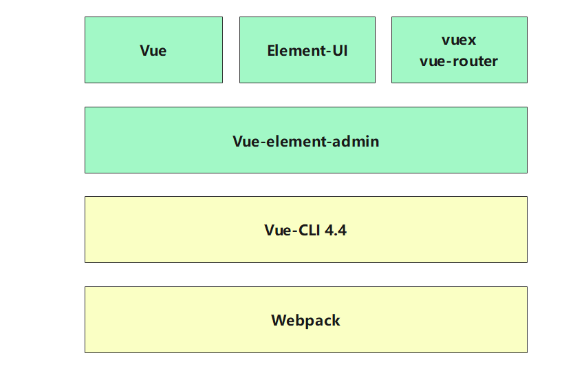

<!--
 * @Description: file content
 * @Author: Erich
 * @Date: 2020-09-11 04:11:14
 * @LastEditors: Erich
 * @LastEditTime: 2020-09-11 04:11:24
-->
##  前端框架

​		本产品使用Vue+Vue-element-admin+Vuex+Vue-router作为前端框架，采用Webpack打包方式进行开发，具有高内聚低耦合的特性。主要实现产品的用户登录、权限管理、0代码应用在线创建、数据整合分析、文件上传下载、企业内部通信及企业知识库管理等功能的操作界面。