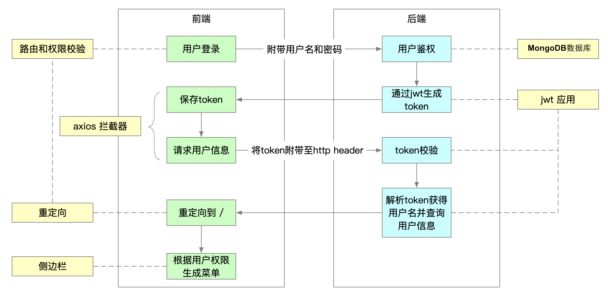

<!--
 * @Description: file content
 * @Author: Erich
 * @Date: 2020-09-11 04:11:36
 * @LastEditors: Erich
 * @LastEditTime: 2020-09-11 04:11:45
-->
## 用户登录

### 登录流程分析

###  登录组件分析

#### 布局分析

登录组件 login.vue 布局要点如下：

- el-form 容器，包含 username 和 password 两个 el-form-item，el-form 主要属性：
  - model 为 loginForm
  - rules 为 loginRules
- password 使用了 el-tooltip 提示，当用户打开大小写时，会进行提示，主要属性：
  - manual：手动控制模式，设置为 true 后，mouseenter 和 mouseleave 事件将不会生效
  - placement：提示出现的位置
- password 对应的 el-input 主要属性：
  - `@keyup.native="checkCapslock"` 键盘按键时绑定 checkCapslock 事件
  - `@keyup.enter.native="handleLogin"` 监听键盘 enter 按下后的事件

> 这里绑定 `@keyup` 事件时需要添加 `.native` 修饰符，这是因为我们的事件绑定在 el-input 组件上，所以如果不添加 `.native` 修饰符，事件将无法绑定到原生的 input 标签上

- 包含一个 el-button，点击时调用 `handleLogin` 方法，并触发 loading 效果